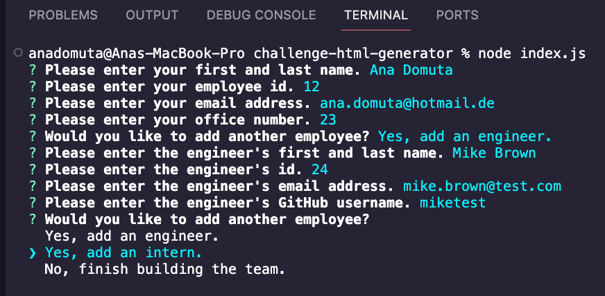
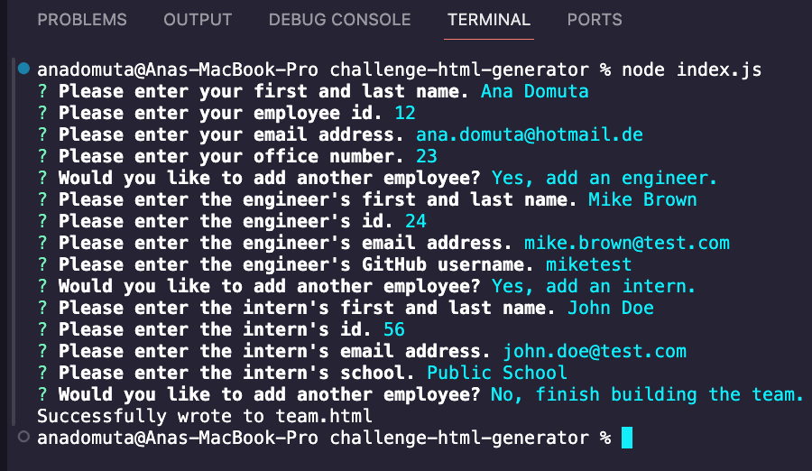
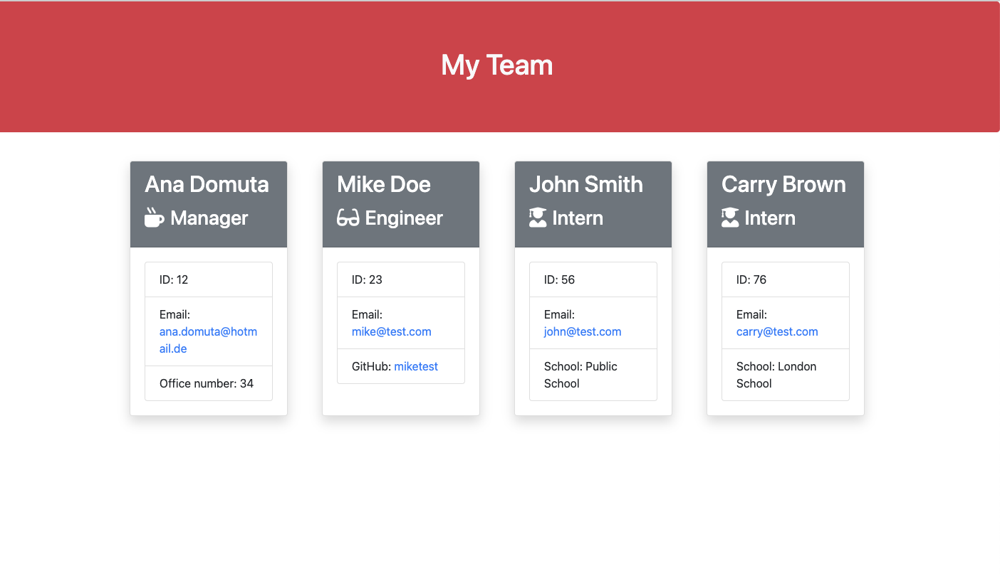

# HTML Generator

An application that generates HTML files using input from a Node.js command-line interface.

## Description

The project represents an application that allows users to take in information about employees on a software engineering team and generate an HTML webpage that displays summaries for each person.

## Usage

- To generate a HTML file, open your terminal, run the command `node index.js` and answer the prompts.

- The user is then prompted to enter the **team manager**'s name, employee ID, email address, and office number.

- When a user enters those requirements, the user is presented with a menu with the option to add an engineer, add an intern or finish building the team.

- When a user selects the **engineer** option, the user is prompted to enter the following and then taken back to the menu: engineer's name, ID, email, and GitHub username.

- When a user selects the **intern** option, the user is prompted to enter the following and then taken back to the menu: intern’s name, ID, email, and school.

The screenshots below display an overview of a sample generated HTML.

## Credits

The project was built following the instructions from the materials in the Skills Bootcamp in Front-End Web Development by edX.

In addition, the following resources were used:

1. Bootcamp content
2. Tutoring session: code consolidation
3. [Code to validate string input](https://www.w3resource.com/javascript/form/all-letters-field.php)
4. Markdown badges from [ileriayo](https://github.com/Ileriayo/markdown-badges?tab=readme-ov-file#markdown-badges)

## License

This project is licensed under the terms of the MIT license.

## Badges

